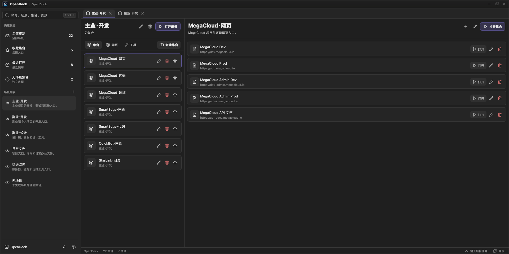

# OpenDock

<p align="center">
  
</p>

<p align="center"><strong>一个面向开发者和专业用户的桌面资源集合与启动工具。</strong></p>
<p align="center">用集合的方式管理目录、网页、命令、文件、应用入口和插件扩展资源，按场景快速打开。</p>

<p align="center">
  
  
  
  
  
  <a href="https://github.com/yedsn/OpenDock/actions/workflows/pages.yml">
    
  </a>
  
</p>

<p align="center">
  <a href="https://yedsn.github.io/OpenDock/">官网</a>
  ·
  <a href="https://gitee.com/hongxiaojian/open-dock">Gitee</a>
  ·
  <a href="https://github.com/yedsn/OpenDock">GitHub</a>
  ·
  <a href="docs/guide/quick-start.md">使用说明</a>
</p>

<p align="center"><strong>🆓 免费 + 开源</strong> · <strong>🤝 社区驱动</strong> · <strong>⭐ 欢迎 Star 和反馈</strong></p>

<p align="center">
  
</p>

---

## 一句话介绍

OpenDock 使用 **Tauri 2 + Rust + Vue 3** 构建，把"桌面资源管理"变成一种低心智负担的日常体验：

- 用工作空间、场景、集合、集合项四级结构组织所有软件相关资源
- 支持目录、网页、命令、文件、Office、CAD、应用等多种资源类型
- 单个打开、批量打开、打开整个集合，一键恢复工作场景
- 插件系统支持自定义资源类型、打开工具和打开流程
- 本地 SQLite 存储，WebDAV 同步，数据始终在自己手中

如果你想要的是一个：

- 不只是书签、不只是项目管理，而是统一管理所有软件使用资源的桌面工具
- 既能收纳不同类型的资源，又能按场景快速打开，还能批量恢复工作上下文
- 可通过插件扩展新的资源类型和打开方式，不被内置功能限制

那么 OpenDock 就是为这个场景设计的。

## 为什么值得用

| 方向 | 你得到什么 |
|------|-------------|
| 集合式资源管理 | 目录、网页、命令、文件、应用入口统一收纳，不再散落各处 |
| 场景驱动启动 | 按场景一键打开单个资源、批量资源或整个集合，快速恢复工作上下文 |
| 多类型打开支持 | 系统默认、浏览器、终端、应用启动、命令执行，不同资源用不同方式打开 |
| 插件扩展平台 | 自定义资源类型、工具类型、表单字段和打开流程，不受内置功能限制 |
| 数据自主可控 | 本地 SQLite 存储 + WebDAV 同步，数据始终在自己手中 |

## 核心概念

### 工作空间

工作空间是 OpenDock 的顶层使用环境，承载用户的全部集合、资源、工具配置和插件配置。

### 场景

场景是对集合的上层归类，可以理解为"某类工作上下文"。项目只是场景的一种。

示例：官网项目、CAD 出图工作、财务报表处理、前端开发环境、常用工具

### 集合

集合是 OpenDock 最核心的管理单位，类似一个可打开的资源收藏夹。

示例：项目目录集合、API 文档集合、Office 文件集合、CAD 图纸集合、开发工具集合

### 集合项

集合项是集合中的单个资源条目，支持多种资源类型：

- **目录**：本地文件夹路径
- **网页**：URL 地址
- **命令**：可执行的 Shell 命令
- **文件**：本地文件路径
- **应用**：本地应用程序

插件还可以贡献更多资源类型，例如 Office 文件、CAD 图纸、设计文件等。

## 核心工作流

### 日常使用

1. 创建场景，例如"前端开发"
2. 在场景下创建集合，例如"项目目录"、"API 文档"
3. 添加集合项：本地目录、网页 URL、命令等
4. 配置每个集合项的打开方式
5. 单击打开单个资源，或一键打开整个集合

### 插件扩展

1. 在插件管理页安装并启用插件
2. 插件贡献新的资源类型和打开工具
3. 在设置页的"打开工具"中看到插件贡献的类型
4. 创建集合时即可使用插件贡献的资源类型和打开方式

### WebDAV 同步

1. 在设置页启用 WebDAV Sync 插件
2. 配置 WebDAV 地址、用户名和密码
3. 工作空间数据自动同步到 WebDAV
4. 在其他设备上恢复相同的工作空间

## 快速开始

### 推荐阅读顺序

- 只想先跑起来：看 `1` 和 `2`
- 想自己构建程序：继续看 `3`
- 想开发插件：跳到"插件开发速览"

### 1. 准备环境

请先阅读：[`docs/guide/quick-start.md`](docs/guide/quick-start.md)

快速摘要：

- 安装 Node.js 18+ 和 npm
- 安装 Rust / Cargo
- 安装 Tauri CLI：`cargo install tauri-cli --locked`
- Windows 需要 VS Build Tools 与 WebView2 Runtime

### 2. 启动桌面应用

```bash
npm install
npm run tauri:dev
```

如果只想启动 Web 前端：

```bash
npm run dev
```

默认访问地址：`http://127.0.0.1:5180`

### 3. 构建发布包

```bash
npm run tauri:build
```

构建产物默认位于：

- Windows：`target/release/bundle/`
- macOS：`target/release/bundle/`

## 插件开发速览

OpenDock 内置插件系统，支持扩展资源类型、打开工具、表单字段和打开流程。

- 插件目录：`plugins/`
- 内置插件：`plugins/.system/`
- 每个插件必须包含 `plugin.json`
- 插件可以贡献 Vue 设置面板和 Rust 服务

完整说明见：[`docs/guide/plugin-development.md`](docs/guide/plugin-development.md)


## 项目状态

这是个独立开发、个人维护的开源项目：

- ❌ 不做 SaaS
- ❌ 不设付费版 / Pro 版
- ❌ 不开放商业授权
- ✅ 所有能力对所有用户平等开放

你的 Star / Issue / PR / 插件贡献，是它继续做下去的全部理由。

觉得好用？欢迎反馈：

- ⭐ [GitHub Star](https://github.com/yedsn/OpenDock)
- 🐛 [提 Issue](https://github.com/yedsn/OpenDock/issues)

## License

本项目采用 **MIT License** 许可证。

- ✅ 允许个人和商业使用、修改、分发、私有 fork
- ✅ 唯一要求：在副本中保留版权声明和许可声明


